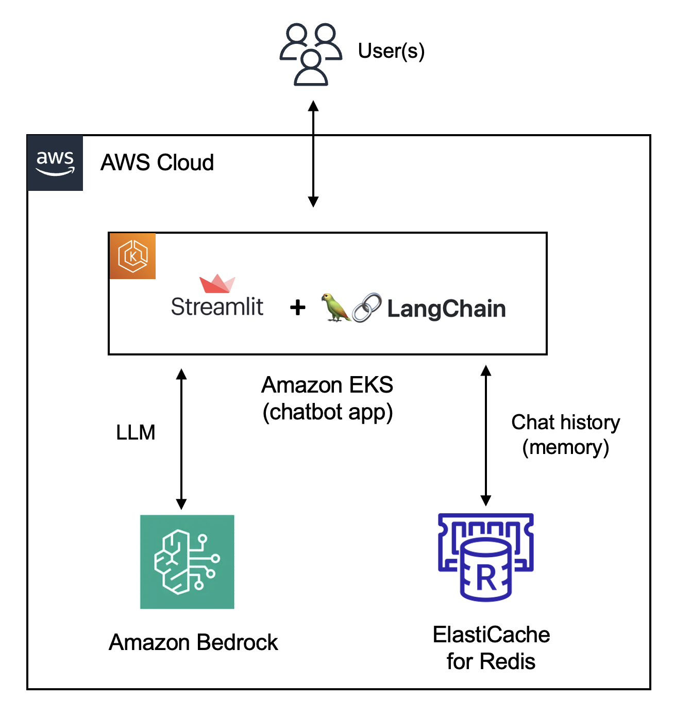

# Streamlit chatbot

Streamlit app on EKS:

- Built using Streamlit and LangChain framework
- Claude on Amazon Bedrock as the LLM
- Redis as the LangChain memory backend to store chat conversation history
- Deployed to Amazon EKS

For details, checkout this blog.

